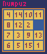

# NumPuz



**NumPuz** is a Simple number puzzle game written in Python with [pyxel](https://github.com/kitao/pyxel)


## How to play

Install pip requirements in `requirements.txt`

```sh
pip install -r .\requirements.txt
```

And Start the game

```sh
python main.py
```

## Control

Use direction keys to slide the blocks.